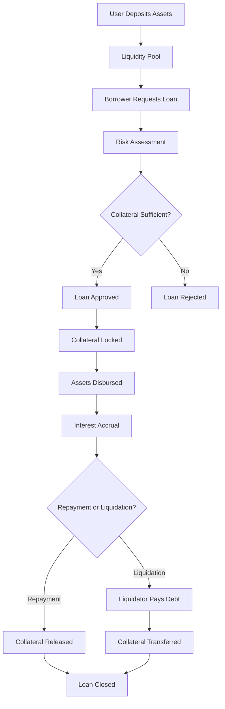

# NexusLend - Advanced DeFi Lending Infrastructure

[]()
[]()
[]()
[]()

## Overview

NexusLend is a next-generation decentralized lending ecosystem that revolutionizes capital allocation on Bitcoin Layer 2 networks. Built with institutional-grade security and retail-friendly accessibility, the protocol enables seamless yield generation and capital efficiency through algorithmic interest rate optimization.

### Key Features

- **Asset Lending**: Deploy capital across multiple asset classes with competitive yields
- **Collateralized Borrowing**: Access instant liquidity without selling your holdings
- **Automated Risk Management**: Dynamic collateral monitoring with instant liquidations
- **Multi-Asset Support**: Seamless integration with diverse token ecosystems
- **Yield Optimization**: Algorithmic interest rate models responding to market conditions
- **Protocol Governance**: Decentralized fee collection and treasury management

## System Architecture

```
┌─────────────────────────────────────────────────────────────────┐
│                        NexusLend Protocol                       │
├─────────────────────────────────────────────────────────────────┤
│  ┌─────────────────┐  ┌─────────────────┐  ┌─────────────────┐ │
│  │  Lending Pool   │  │  Borrowing      │  │  Liquidation    │ │
│  │  Management     │  │  Engine         │  │  System         │ │
│  └─────────────────┘  └─────────────────┘  └─────────────────┘ │
├─────────────────────────────────────────────────────────────────┤
│  ┌─────────────────┐  ┌─────────────────┐  ┌─────────────────┐ │
│  │  Risk           │  │  Oracle         │  │  Protocol       │ │
│  │  Management     │  │  Integration    │  │  Governance     │ │
│  └─────────────────┘  └─────────────────┘  └─────────────────┘ │
├─────────────────────────────────────────────────────────────────┤
│                    Stacks Blockchain Layer                     │
└─────────────────────────────────────────────────────────────────┘
```

## Contract Architecture

### Core Components

#### 1. **Asset Management**

- **Supported Assets Registry**: Multi-asset support with oracle integration
- **Supply/Withdraw Operations**: Secure asset deposit and withdrawal mechanisms
- **Liquidity Tracking**: Real-time monitoring of available liquidity

#### 2. **Lending Engine**

- **Loan Creation**: Automated risk assessment and loan origination
- **Interest Calculation**: Block-based compound interest accrual
- **Repayment Processing**: Flexible partial and full repayment options

#### 3. **Risk Management**

- **Collateral Ratio Monitoring**: Dynamic cross-asset ratio calculations
- **Liquidation Engine**: Automated liquidation of undercollateralized positions
- **Circuit Breakers**: Emergency pause functionality for market volatility

#### 4. **Oracle Integration**

- **Price Feed Management**: Real-time asset pricing via oracle networks
- **Multi-Oracle Support**: Configurable oracle sources per asset
- **Price Validation**: Error handling for oracle failures

## Risk Parameters

| Parameter | Value | Description |
|-----------|-------|-------------|
| **Minimum Collateral Ratio** | 125% | Conservative LTV for enhanced security |
| **Liquidation Threshold** | 110% | Automated liquidation trigger point |
| **Liquidation Penalty** | 10% | Penalty fee for protocol protection |
| **Protocol Fee** | 0.5% | Sustainable fee structure |

## Data Flow



## Getting Started

### Prerequisites

- [Clarinet](https://github.com/hirosystems/clarinet) for local development
- [Stacks CLI](https://docs.stacks.co/docs/write-smart-contracts/cli-wallet-quickstart) for deployment
- Node.js 16+ for testing environment

### Installation

1. **Clone the repository**

   ```bash
   git clone https://github.com/mason-joshua/nexus-lend.git
   cd nexus-lend
   ```

2. **Install dependencies**

   ```bash
   npm install
   ```

3. **Run tests**

   ```bash
   npm test
   # or
   clarinet test
   ```

4. **Check contracts**

   ```bash
   clarinet check
   ```

### Local Development

1. **Start local development environment**

   ```bash
   clarinet console
   ```

2. **Deploy contracts locally**

   ```bash
   clarinet deploy --testnet
   ```

## Usage Examples

### Supplying Assets

```clarity
;; Supply 1000 STX to earn yield
(contract-call? .nexus-lend supply-asset 
  "STX" 
  u1000000000  ;; 1000 STX (6 decimals)
  .stx-token)
```

### Creating a Loan

```clarity
;; Borrow 500 USDC against 1000 STX collateral
(contract-call? .nexus-lend create-loan
  "STX"         ;; Collateral asset
  u1000000000   ;; 1000 STX
  "USDC"        ;; Borrowed asset  
  u500000000    ;; 500 USDC
  .stx-token    ;; Collateral token contract
  .usdc-token)  ;; Borrowed token contract
```

### Repaying a Loan

```clarity
;; Repay loan with ID 1
(contract-call? .nexus-lend repay-loan
  u1           ;; Loan ID
  u525000000   ;; Repayment amount (principal + interest)
  .usdc-token) ;; Borrowed token contract
```

## API Reference

### Read-Only Functions

| Function | Description | Returns |
|----------|-------------|---------|
| `get-protocol-info` | Protocol status and metrics | Protocol info object |
| `get-asset-info` | Asset configuration and stats | Asset info object |
| `get-asset-price` | Real-time asset pricing | Price in base units |
| `get-loan` | Detailed loan information | Loan object |
| `calculate-collateral-ratio` | Current collateral ratio | Percentage ratio |
| `is-loan-liquidatable` | Liquidation eligibility | Boolean result |

### Public Functions

| Function | Description | Access |
|----------|-------------|---------|
| `supply-asset` | Deposit assets to earn yield | Public |
| `withdraw-asset` | Withdraw supplied assets | Public |
| `create-loan` | Create collateralized loan | Public |
| `repay-loan` | Repay loan with interest | Public |
| `add-collateral` | Enhance loan collateral | Borrower only |
| `liquidate-loan` | Liquidate undercollateralized loan | Public |

### Administrative Functions

| Function | Description | Access |
|----------|-------------|---------|
| `add-supported-asset` | Register new asset | Owner only |
| `set-asset-active` | Toggle asset availability | Owner only |
| `set-protocol-paused` | Emergency pause protocol | Owner only |
| `withdraw-protocol-fees` | Withdraw accumulated fees | Owner only |

## Security Considerations

### Risk Mitigation

- **Conservative Collateralization**: 125% minimum ratio with 15% liquidation buffer
- **Oracle Dependencies**: Multi-oracle support with fallback mechanisms
- **Circuit Breakers**: Emergency pause functionality for unprecedented conditions
- **Liquidation Incentives**: 10% penalty ensures prompt liquidation of risky positions

### Audit Status

- [ ] Internal security review
- [ ] External audit (pending)
- [ ] Bug bounty program (planned)

## Contributing

We welcome contributions from the community! Please see our [Contributing Guidelines](CONTRIBUTING.md) for details.

### Development Workflow

1. Fork the repository
2. Create a feature branch
3. Write tests for new functionality
4. Ensure all tests pass
5. Submit a pull request

## Roadmap

### Phase 1: Core Protocol ✅

- [x] Basic lending and borrowing
- [x] Collateral management
- [x] Liquidation system
- [x] Oracle integration

### Phase 2: Advanced Features 🚧

- [ ] Flash loans
- [ ] Interest rate models
- [ ] Governance tokens
- [ ] Cross-chain integration

### Phase 3: Ecosystem Growth 📋

- [ ] Mobile application
- [ ] Yield farming
- [ ] Insurance protocol
- [ ] Institutional features

## License

This project is licensed under the MIT License - see the [LICENSE](LICENSE) file for details.
